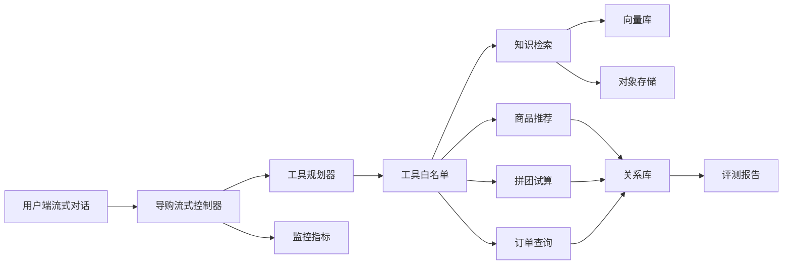

# Agent Group：电商导购拼团支付 `Agent`（智能体）系统

## 项目定位

本项目是一个面向电商导购、拼团营销和支付交易链路的 `AI Agent`（人工智能智能体）系统，不只做问答，而是基于 `Spring AI`（Spring 人工智能框架）把“意图理解、知识检索、商品推荐、拼团试算、导购报价凭证、下单锁单、支付回调、退款补偿、质量评测、运行监控”串成闭环。

适合在简历中定位为：`Java`（后端语言）后端 + `AI`（人工智能）导购交易工程项目。

## 核心亮点

1. 导购拼团主链路：围绕商品知识、用户需求和拼团活动生成推荐结果，回答过程展示知识片段、商品卡片、拼团价、成团人数和购买入口。
2. 导购报价凭证下单：导购推荐会生成 `decisionId`（决策编号），作为本轮商品、活动、金额和报价有效期的下单凭证；直接购买和拼团购买时后端都会重新校验，保证导购卡片、订单金额和支付单金额一致。
3. 工具型 `Agent`（智能体）：后端维护工具白名单，支持知识检索、商品推荐、拼团试算、订单查询等工具，流式返回工具计划和执行过程。
4. 拼团交易闭环：支持拼团活动试算、锁单占位、队伍名额控制、支付成功后的成团结算、未成团退款和通知任务。
5. 支付订单闭环：支持直接购买和拼团购买两种路径，覆盖支付单创建、支付回调验签、防重放、订单状态流转、退款和补偿任务。
6. 知识库闭环：上传商品详情、活动规则、售后政策后，解析、切片、向量化并优先通过 `Spring AI VectorStore`（向量存储接口）写入 `pgvector`（向量库），文档原件保存到 `MinIO`（对象存储）。
7. 质量评测与监控：50 条评测用例覆盖导购推荐、拼团报价、售后规则、订单查询、支付状态和多轮追问，并通过 `Prometheus`（指标采集工具）和 `Grafana`（指标看板工具）观察运行状态。

## 架构概览



## 技术栈

- 后端：`Java 21`（后端语言）、`Spring Boot 3`（后端框架）、`Spring AI`（Spring 人工智能框架）、`MyBatis`（数据访问框架）
- 存储：`MySQL`（关系型数据库）、`Redis`（缓存数据库）、`pgvector`（向量库）、`MinIO`（对象存储）
- 消息与任务：`RabbitMQ`（消息队列）、定时补偿任务、交易事件 `Outbox`（事务消息表）
- 大模型链路：`Spring AI ChatClient`（聊天客户端）、`EmbeddingModel`（向量模型接口）、`VectorStore`（向量存储接口）、`RAG`（检索增强生成）、工具调用、流式输出、多模态图片解析
- 工程治理：`Actuator`（应用监控端点）、`Prometheus`（指标采集工具）、`Grafana`（指标看板工具）、批量评测

## 本地启动

```powershell
cd docs/dev-ops
docker compose -f docker-compose-environment.yml up -d
```

```powershell
$env:AGENT_GROUP_EVALUATE_CASE_FILE="E:\javaproject\agent-group\docs\sample-knowledge\evaluation-cases.json"
cd E:\javaproject\agent-group\backend
mvn -pl agent-group-app -am spring-boot:run
```

浏览器打开：

- `frontend/index.html`（用户端导购演示）
- `frontend/admin.html`（运营端知识库、评测和交易监控）
- `http://127.0.0.1:13000`（`Grafana` 指标看板）

## 推荐演示路径

1. 在用户端点击“运行示例”，观察流式回答、工具计划、知识片段和商品卡片。
2. 点击“拼团购买”，观察导购报价凭证 `decisionId`（决策编号）校验、锁单、支付单、支付回调演示和订单状态流转。
3. 在运营端上传 `docs/sample-knowledge` 下的知识文档，验证文档入库、切片和向量检索。
4. 执行评测，观察工具调用正确率、工具参数正确率、工具结果引用率和回答准确率。
5. 打开 `Grafana`（指标看板工具），查看工具调用速率、工具平均耗时、模型耗时和回退次数。

## 简历表述

基于 `Java 21`（后端语言）、`Spring Boot 3`（后端框架）和 `Spring AI`（Spring 人工智能框架）实现电商导购拼团支付 `AI Agent`（人工智能智能体）系统，将商品知识库、工具调用、导购报价凭证、拼团锁单、支付回调、退款补偿和离线评测串成闭环；支持用户从智能咨询进入商品推荐、拼团试算、直接购买或拼团购买，并通过幂等控制、防重放、交易状态流水和监控看板保障导购、拼团和支付流程稳定运行。
