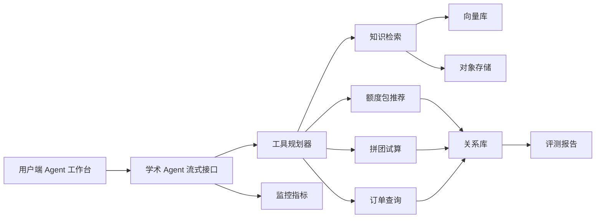

# 基于 `Spring AI`（Spring 人工智能框架）的学术 `Agent`（智能体）额度与拼团支付系统

## 项目定位

本项目是一个面向研究生学习和科研辅助场景的 `AI Agent`（人工智能智能体）平台，核心路径是“注册登录 -> 购买额度 -> 使用额度运行 `Agent`（智能体）-> 记录额度消耗 -> 拼团、支付和退款闭环”。

适合在简历中定位为：基于 `Spring AI`（Spring 人工智能框架）的学术 `Agent`（智能体）额度交易系统。

## 核心亮点

1. 学术 `Agent`（智能体）工作台：支持流式对话、文件问答、论文精读、`PPT`（演示文稿）生成、图表重建和深度研究任务。
2. 额度账户闭环：用户通过直接购买或拼团购买额度包，后端根据订单和支付状态发放额度，`Agent`（智能体）调用后记录额度消耗流水。
3. 拼团交易闭环：支持拼团活动试算、锁单占位、队伍名额控制、支付成功后的成团结算、未成团退款和通知补偿。
4. 支付订单闭环：支持直接购买和拼团购买两种路径，覆盖支付单创建、支付回调验签、防重放、订单状态流转、退款和补偿任务。
5. 知识库闭环：上传额度包说明、活动规则、学术任务资料后，解析、切片、向量化并优先通过 `Spring AI VectorStore`（向量存储接口）写入 `pgvector`（向量库）。
6. 质量评测与监控：围绕知识召回、回答准确率、任务匹配率、工具调用正确率、额度扣减和交易状态一致性做批量评测。

## 架构概览



## 技术栈

- 后端：`Java 21`（后端语言）、`Spring Boot 3`（后端框架）、`Spring AI`（Spring 人工智能框架）、`MyBatis`（数据访问框架）。
- 存储：`MySQL`（关系型数据库）、`Redis`（缓存数据库）、`pgvector`（向量库）、`MinIO`（对象存储）。
- 消息与任务：`RabbitMQ`（消息队列）、定时补偿任务、交易事件 `Outbox`（事务消息表）。
- 大模型链路：`Spring AI ChatClient`（聊天客户端）、`EmbeddingModel`（向量模型接口）、`VectorStore`（向量存储接口）、`RAG`（检索增强生成）、工具调用、流式输出。
- 工程治理：`Actuator`（应用监控端点）、`Prometheus`（指标采集工具）、`Grafana`（指标看板工具）、批量评测。

## 本地启动

```powershell
cd docs/dev-ops
docker compose -f docker-compose-environment.yml up -d
```

```powershell
cd E:\javaproject\agent-group\backend
mvn -pl agent-group-app -am spring-boot:run
```

浏览器打开：

- `frontend/index.html`（用户端 `Agent`（智能体）工作台）
- `frontend/admin.html`（运营端知识库、评测和交易监控）
- `http://127.0.0.1:13000`（`Grafana`（指标看板工具））

## 推荐演示路径

1. 注册或登录账号，在额度中心查看当前余额和额度流水。
2. 选择额度包，分别演示直接购买和拼团购买，观察支付回调、成团状态、额度到账和退款边界。
3. 使用额度运行论文精读、文件问答、`PPT`（演示文稿）大纲或图表重建任务，观察流式回答和额度消耗记录。
4. 在运营端上传知识文档，验证文档入库、切片、向量检索和失败补偿。
5. 执行评测，观察工具调用正确率、工具参数正确率、工具结果引用率、回答准确率和任务匹配率。

## 简历表述

基于 `Java 21`（后端语言）、`Spring Boot 3`（后端框架）和 `Spring AI`（Spring 人工智能框架）实现学术 `Agent`（智能体）额度与拼团支付系统，将登录注册、额度账户、学术任务、知识检索、拼团锁单、支付回调、退款补偿和离线评测串成闭环；支持用户购买额度后运行论文精读、文件问答、`PPT`（演示文稿）生成、图表重建等任务，并通过幂等控制、防重放、交易状态流水和监控看板保障额度、订单和支付状态一致。
