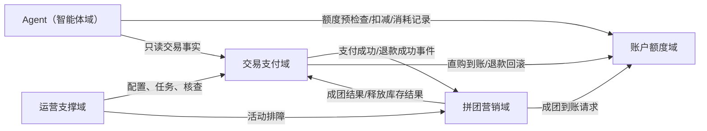

# 模块化单体业务域拆分说明

本文用于说明当前项目为什么不拆成多个服务，以及这次后端包结构拆分后的边界。

## 拆分结论

当前项目采用“一个 `Spring Boot`（后端启动框架）应用 + 多业务域边界”的方式。

- 不新增多个 `Maven`（构建工具）子应用。
- 不引入注册中心、网关或分布式事务框架。
- 保留现有接口路径，避免前端和演示脚本大面积调整。
- 重点把 `Agent`（智能体）、交易支付、拼团营销、账户额度和运营支撑拆清楚。

这样做的原因是：秋招项目需要稳定演示完整业务闭环，第一阶段不适合把系统拆成多个启动应用。当前更重要的是把领域边界、状态一致性和事件协作讲清楚。

## 当前业务域

| 业务域 | 主要职责 | 代码落点 |
| --- | --- | --- |
| `Agent`（智能体域） | 学术会话、知识库、工具调用、运行账本、回放、评测 | `domain/academic`、`domain/agent`、`infrastructure/agent`、`trigger/http/agent` |
| 交易支付域 | 订单、支付单、退款单、支付回调、状态流水、可靠消息、一致性核查 | `domain/trade`、`infrastructure/trade`、`trigger/http/trade` |
| 拼团营销域 | 活动、锁单、队伍、库存、成团、拼团规则链、拼团退款规则 | `domain/groupbuy`、`infrastructure/groupbuy`、`trigger/http/groupbuy` |
| 账户额度域 | 用户、会员、额度账户、额度流水、额度发放、扣减和回滚 | `domain/account`、`infrastructure/account`、`trigger/http/account` |
| 运营支撑域 | 动态配置、定时任务、分布式锁、监控、异常处理和后台排障 | `domain/support`、`infrastructure/support`、`trigger/http/ops`、`trigger/http/support` |

基础设施层仍保留 `dao`（数据库访问对象）和 `po`（持久化对象）作为共享持久化映射目录，避免为了拆包影响 `MyBatis`（数据库访问框架）映射文件。

## 协作关系

这版先约定几个硬边界：

- 交易支付域只判断订单、支付、退款和交易状态，不直接写拼团库存。
- 拼团营销域只判断活动、队伍、库存和是否成团，不直接发放额度。
- 账户额度域只负责发放、扣减、回滚和记录额度流水。
- `Agent`（智能体）只能读取后端交易事实，不能决定余额、到账、退款或成团状态。
- 运营支撑域负责配置、任务和排障，不把业务判断散落在定时任务里。

## 事件语义

交易侧仍以状态流水、幂等键和 `Outbox`（本地消息表）保证一致性：

1. 直购支付成功后，交易支付域更新订单和支付单，再请求账户额度域发放额度。
2. 拼团支付成功后，只记录名额已支付，不发放额度。
3. 拼团成团后，拼团营销域产生成团结果，再推动账户额度域发放额度。
4. 退款成功后，交易支付域记录退款结果，拼团营销域释放名额或恢复库存，账户额度域按到账流水回滚额度。
5. `Agent`（智能体）任务完成后，只写运行账本和额度消耗流水，不反向修改交易事实。

所有事件消费都按幂等处理，重复回调、重复成团事件、重复退款事件不会重复发放或回滚额度。

## 面试表达

可以这样介绍：

> 这个项目没有一开始拆微服务，而是先做模块化单体。后端仍是一个启动应用，但内部按 `Agent`（智能体）、交易支付、拼团营销、账户额度和运营支撑拆成清晰业务域。域之间通过领域服务接口和事件协作，交易状态、拼团成团和额度账本都保留自己的边界。这样既能稳定演示完整链路，也能体现后端领域建模、交易一致性和事件驱动设计能力。
